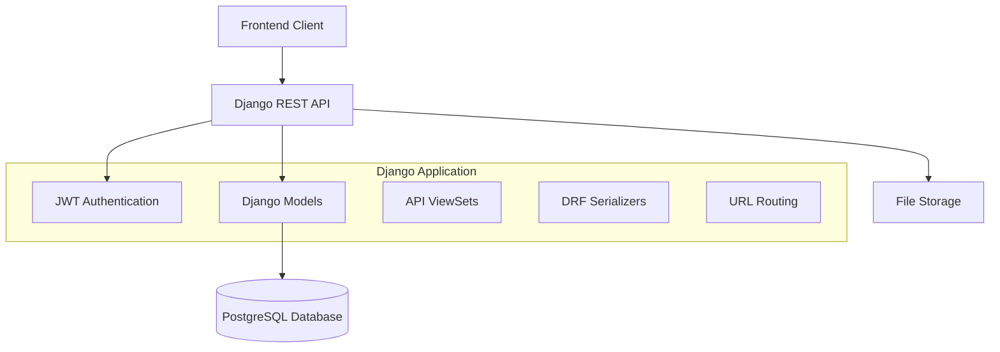

# Design Document

## Overview

The collaborative worldbuilding application is built as a Django REST API with PostgreSQL backend, designed around immutable content creation and chronological integrity. The system uses a multi-tenant approach where each World acts as a container for related content, with JWT authentication ensuring secure access and proper attribution of contributions.

## Architecture

### High-Level Architecture



### Technology Stack

- **Backend Framework**: Django 4.x with Django REST Framework
- **Database**: PostgreSQL with proper indexing for performance
- **Authentication**: JWT tokens via django-rest-framework-simplejwt
- **File Storage**: Django's file handling (configurable for cloud storage)
- **API Documentation**: Auto-generated via DRF
- **CORS**: django-cors-headers for frontend integration

## Components and Interfaces

### Core Models

#### User Model
- Extends Django's built-in User model
- Additional fields for worldbuilding preferences
- Tracks contribution statistics

#### World Model
```python
class World(models.Model):
    title = models.CharField(max_length=200)
    description = models.TextField()
    creator = models.ForeignKey(User, on_delete=models.CASCADE)
    created_at = models.DateTimeField(auto_now_add=True)
    is_public = models.BooleanField(default=True)
    
    class Meta:
        ordering = ['-created_at']
```

#### Content Base Model (Abstract)
```python
class ContentBase(models.Model):
    title = models.CharField(max_length=300)
    content = models.TextField()
    author = models.ForeignKey(User, on_delete=models.CASCADE)
    world = models.ForeignKey(World, on_delete=models.CASCADE)
    created_at = models.DateTimeField(auto_now_add=True)
    
    class Meta:
        abstract = True
        ordering = ['-created_at']
```

#### Specific Content Models
- **Page**: Wiki entries and general content (inherits ContentBase)
- **Essay**: Long-form analytical content (inherits ContentBase)
- **Character**: Character profiles with structured fields
- **Story**: Narrative content with story-specific metadata
- **Image**: Visual content with file upload handling

#### Tag and Link Models
```python
class Tag(models.Model):
    name = models.CharField(max_length=100, unique=True)
    world = models.ForeignKey(World, on_delete=models.CASCADE)
    
class ContentTag(models.Model):
    content_type = models.ForeignKey(ContentType, on_delete=models.CASCADE)
    object_id = models.PositiveIntegerField()
    content_object = GenericForeignKey('content_type', 'object_id')
    tag = models.ForeignKey(Tag, on_delete=models.CASCADE)

class ContentLink(models.Model):
    from_content_type = models.ForeignKey(ContentType, on_delete=models.CASCADE, related_name='links_from')
    from_object_id = models.PositiveIntegerField()
    from_content = GenericForeignKey('from_content_type', 'from_object_id')
    
    to_content_type = models.ForeignKey(ContentType, on_delete=models.CASCADE, related_name='links_to')
    to_object_id = models.PositiveIntegerField()
    to_content = GenericForeignKey('to_content_type', 'to_object_id')
    
    created_at = models.DateTimeField(auto_now_add=True)
```

### API Design

#### Authentication Endpoints
- `POST /api/token/` - Obtain JWT token pair
- `POST /api/token/refresh/` - Refresh access token
- `POST /api/token/verify/` - Verify token validity
- `POST /api/register/` - User registration

#### World Management
- `GET /api/collab/worlds/` - List all worlds
- `POST /api/collab/worlds/` - Create new world
- `GET /api/collab/worlds/{id}/` - Get world details
- `PUT /api/collab/worlds/{id}/` - Update world (creator only)

#### Content Management
- `GET /api/collab/worlds/{world_id}/pages/` - List pages in world
- `POST /api/collab/worlds/{world_id}/pages/` - Create new page
- `GET /api/collab/worlds/{world_id}/pages/{id}/` - Get specific page
- Similar patterns for essays, characters, stories, images, storyboards 

#### Tagging and Linking
- `GET /api/collab/worlds/{world_id}/tags/` - List world tags
- `POST /api/collab/content/{content_type}/{id}/tags/` - Add tags to content
- `GET /api/collab/content/{content_type}/{id}/links/` - Get content links
- `POST /api/collab/content/{content_type}/{id}/links/` - Create content links

### ViewSets and Serializers

#### World ViewSet
- Handles CRUD operations for worlds
- Filters content by world membership
- Implements creator-only edit permissions

#### Content ViewSets
- Separate viewsets for each content type
- Implements immutability (no PUT/PATCH after creation)
- Handles file uploads for images
- Automatic timestamp and author assignment

#### Serializer Design
- Nested serializers for related data (tags, links)
- Read-only fields for timestamps and authors
- Validation for world membership and permissions

## Data Models

### Database Schema Design

#### Indexing Strategy
```sql
-- Performance indexes
CREATE INDEX idx_content_world_created ON collab_page(world_id, created_at DESC);
CREATE INDEX idx_content_author ON collab_page(author_id);
CREATE INDEX idx_tags_world ON collab_tag(world_id);
CREATE INDEX idx_content_tags_lookup ON collab_contenttag(content_type_id, object_id);

-- Full-text search indexes
CREATE INDEX idx_page_content_search ON collab_page USING gin(to_tsvector('english', title || ' ' || content));
```

#### Constraints and Relationships
- Foreign key constraints ensure referential integrity
- Unique constraints on tag names within worlds
- Check constraints for content immutability
- Generic foreign keys for flexible content linking

### Content Immutability Implementation

#### Model-Level Protection
```python
class ImmutableModelMixin:
    def save(self, *args, **kwargs):
        if self.pk and not kwargs.get('force_update', False):
            raise ValidationError("Content cannot be modified after creation")
        super().save(*args, **kwargs)
    
    def delete(self, *args, **kwargs):
        raise ValidationError("Content cannot be deleted")
```

#### API-Level Protection
- ViewSets only allow POST and GET operations
- Custom permissions prevent modification attempts
- Audit logging for all content creation

## Error Handling

### API Error Responses
```python
{
    "error": "validation_error",
    "message": "Content cannot be modified after creation",
    "details": {
        "field": "content",
        "code": "immutable_content"
    },
    "timestamp": "2025-01-21T10:30:00Z"
}
```

### Database Error Handling
- Connection pooling with retry logic
- Transaction rollback on constraint violations
- Graceful degradation for non-critical features

### File Upload Error Handling
- File size and type validation
- Virus scanning integration points
- Storage quota management

## Testing Strategy

### Unit Testing
- Model validation and constraint testing
- Serializer validation testing
- Custom permission class testing
- Immutability enforcement testing

### Integration Testing
- API endpoint testing with authentication
- Database transaction testing
- File upload workflow testing
- Cross-content linking testing

### Performance Testing
- Database query optimization testing
- API response time benchmarking
- Concurrent user simulation
- Large dataset handling validation

### Security Testing
- JWT token validation testing
- Permission boundary testing
- Input sanitization validation
- CORS configuration testing

## Deployment Considerations

### Database Configuration
```python
DATABASES = {
    'default': {
        'ENGINE': 'django.db.backends.postgresql',
        'NAME': os.environ.get('DB_NAME', 'worldbuilding'),
        'USER': os.environ.get('DB_USER', 'postgres'),
        'PASSWORD': os.environ.get('DB_PASSWORD'),
        'HOST': os.environ.get('DB_HOST', 'localhost'),
        'PORT': os.environ.get('DB_PORT', '5432'),
        'OPTIONS': {
            'MAX_CONNS': 20,
        }
    }
}
```

### Security Settings
- CORS configuration for frontend domains
- JWT token expiration policies
- Rate limiting for API endpoints
- File upload security measures

### Scalability Considerations
- Database connection pooling
- Caching strategy for frequently accessed content
- CDN integration for image serving
- Horizontal scaling preparation